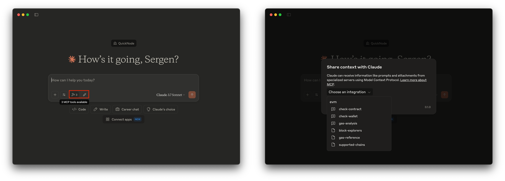

# EVM MCP Server

An MCP server built in TypeScript that enables LLM agents to access EVM blockchain data on the Plasma mainnet using QuickNode endpoints.

**Written tutorial of this project**: [Create an EVM MCP Server with Claude Desktop](https://www.quicknode.com/guides/ai/evm-mcp-server?utm_source=internal&utm_campaign=sample-apps&utm_content=evm-mcp-server)



## Tech Stack

- [MCP TypeScript SDK](https://www.npmjs.com/package/@modelcontextprotocol/sdk)
- [TypeScript](https://www.typescriptlang.org/)
- [Viem](https://viem.sh/)
- [QuickNode](https://www.quicknode.com?utm_source=internal&utm_campaign=sample-apps&utm_content=evm-mcp-server)

## Features

- **MCP-Compatible**: Built using the Model Context Protocol SDK to directly talk to LLM agents
- **Plasma-Only Support**: Defaults to and enforces the Plasma mainnet
- **Core EVM Methods**: Includes `eth_getBalance`, `eth_getCode`, and `eth_gasPrice`
- **Dual-Source Results**: Core tools query both QuickNode RPC and Routescan (Etherscan-compatible) for cross-checks where applicable
- **LLM Prompts**: Pre-built prompts for wallet analysis, contract inspection, and gas price evaluation

## Prerequisites

- [Node.js](https://nodejs.org/en) >= 18
- QuickNode account (create a free one [here](https://www.quicknode.com/signup?utm_source=internal&utm_campaign=sample-apps&utm_content=evm-mcp-server))
- TypeScript
- Claude Desktop or any other MCP-compatible agent runner

### QuickNode Endpoint and Token ID
1. Sign up at [QuickNode](https://www.quicknode.com/signup?utm_source=internal&utm_campaign=sample-apps&utm_content=evm-mcp-server)
2. Create a multichain endpoint. See the [How to Use the QuickNode Multichain Endpoint](https://www.quicknode.com/guides/quicknode-products/how-to-use-multichain-endpoint?utm_source=internal&utm_campaign=sample-apps&utm_content=evm-mcp-server) for more details.
3. From the endpoint URL `https://your-endpoint.plasma-mainnet.quiknode.pro/your-token-id/` (for Plasma):
   - Extract the endpoint name (replace `your-endpoint`)
   - Extract the token ID (replace `your-token-id-here`)
4. Keep the endpoint name and token ID for later use.

## Project Instructions

1. Clone the repository

```bash
git clone https://github.com/quiknode-labs/qn-guide-examples.git
cd qn-guide-examples/AI/evm-mcp-server
```

2. Install dependencies

```bash
npm install
```

3. Build the project

Compile the TypeScript code:

```bash
npm run build
```

## Project Structure

```bash
├── chains.ts           # Chain configuration and QuickNode endpoint mapping
├── clients.ts          # Viem public client creator for RPC connections
├── index.ts            # Main entry point that sets up the MCP server
├── package.json        # Package configuration
├── prompts.ts          # Defines LLM prompts for blockchain analysis tasks
├── resources.ts        # External references and helpers
├── tools.ts            # Implements the EVM RPC methods as MCP tools
└── tsconfig.json       # TypeScript configuration
```


## Configure Claude Desktop 

Environment variables are used to configure the server. These variables will be defined in Claude Desktop's configuration file, `claude_desktop_config.json`.

To configure, open the **Claude Desktop** app, go to **Claude** > **Settings** > **Developer**. Then, modify the `claude_desktop_config.json` file with the following content: (if you already have other configurations, add the new configuration under the `mcpServers` object)

```json
{
    "mcpServers": {
        "evm": {
            "command": "node",
            "args": [
                "/absolute-path-to/evm-mcp-server/build/index.js"
            ],
            "env": {
                "QN_ENDPOINT_NAME": "your-quicknode-endpoint-name",
                "QN_TOKEN_ID": "your-quicknode-token-id",
                "DEPLOYER_PRIVATE_KEY": "0xyour-32-byte-private-key", 
                "SOURCIFY_URL": "https://sourcify.dev/server",
                "ROUTESCAN_API_KEY": "your-routescan-api-key"
            }
        }
    }
}
```

- Replace `your-quicknode-endpoint-name` with the name of your QuickNode endpoint.
- Replace `your-quicknode-token-id` with the token ID of your QuickNode endpoint.
- Replace `/absolute-path-to` with the absolute path to the `evm-mcp-server` directory.
- `DEPLOYER_PRIVATE_KEY` is required only for contract deployment. Keep it secret; never commit to git.
- `SOURCIFY_URL` is optional; defaults to `https://sourcify.dev/server`.
- `ROUTESCAN_API_KEY` is optional; used for Routescan explorer API and Etherscan-compatible queries.

## Test the MCP Server

Restart **Claude Desktop** and test the server by asking Claude Desktop to perform a task that requires the EVM MCP Server. Queries default to Plasma mainnet and other chains are rejected.

### Example Agent Interactions

1. Check a wallet balance (Plasma):
```
Give the balance of 0x0000000000000000000000000000000000000000 on Plasma
```

2. Analyze a contract (Plasma):

```
Analyze 0x0000000000000000000000000000000000000000 on Plasma
```

3. Get current gas prices (Plasma):

```
Analyze the current gas prices on Plasma; is it a good time to use the chain?
```


### MCP Tools

1. **eth_getBalance**
   - **Description**: Get the ETH/native token balance of an address
   - **Parameters**:
     - `address`: EVM address to check
     - `chain`: Optional; defaults to `plasma` (other values are rejected)
   - **Returns**: 
     - Address, chain, balance in wei and formatted, plus `rpc.endpoint` and a `routescan` object with the Etherscan-style response

2. **eth_getCode**
   - **Description**: Detect whether an address is a contract or wallet
   - **Parameters**:
     - `address`: EVM address to check
     - `chain`: Optional; defaults to `plasma` (other values are rejected)
   - **Returns**: 
     - Address info, contract status, bytecode size, and `routescan` contract metadata (getsourcecode) if available

3. **eth_gasPrice**
   - **Description**: Get the current gas price on the specified chain
   - **Parameters**:
     - `chain`: Optional; defaults to `plasma` (other values are rejected)
   - **Returns**: 
     - Chain name, gas price in wei and Gwei, timestamp, plus Routescan gas oracle response

4. **contract_verify**
   - **Description**: Verify contract sources via Sourcify on Plasma.
   - **Parameters**:
     - `address`: EVM address to verify
     - `chain`: Optional; defaults to `plasma`
     - One of: `metadataJson` (stringified metadata) OR `sources` (array of `{ path, content }`)
   - **Returns**: Sourcify verification response and status check

5. **contract_deploy**
   - **Description**: Deploy a contract using your QuickNode RPC and `DEPLOYER_PRIVATE_KEY`.
   - **Parameters**:
     - `chain`: Optional; defaults to `plasma`
     - `bytecode`: 0x-prefixed bytecode
     - `abi`: Contract ABI
     - `args`: Constructor arguments (optional)
     - `value`, `maxFeePerGas`, `maxPriorityFeePerGas`, `gas`, `nonce` (all optional)
   - **Returns**: `txHash`, `contractAddress`, `status`, `gasUsed`

6. **proxy_inspect**
   - **Description**: Detect common proxies (EIP‑1967) by reading storage slots.
   - **Parameters**:
     - `address`: Contract address
     - `chain`: Optional; defaults to `plasma`
   - **Returns**: `{ isProxy, implementation, admin, beacon }`

7. **routescan_addresses**
   - **Description**: List recent addresses via Routescan explorer API for the configured chain.
   - **Parameters**:
     - `chain`: Optional; defaults to `plasma`
     - `limit`: Optional; default `25`, max `100`
     - `cursor`: Optional; pagination cursor from previous response
     - `apiKey`: Optional; overrides `ROUTESCAN_API_KEY`
   - **Returns**: Endpoint used and raw JSON response from Routescan

8. **routescan_etherscan**
   - **Description**: Call Routescan's Etherscan-compatible endpoint using `module` and `action`.
   - **Parameters**:
     - `chain`: Optional; defaults to `plasma`
     - `module`: Etherscan module (e.g., `account`)
     - `action`: Etherscan action (e.g., `txlist`)
     - `params`: Optional record of additional query params (e.g., `address`, `startblock`)
     - `apiKey`: Optional; overrides `ROUTESCAN_API_KEY`
   - **Returns**: Endpoint used and raw JSON response from Routescan

### MCP Prompts

The server provides the following MCP prompts:

1. **check-wallet**
   - **Description**: Guide for analyzing a wallet's balance and context
   - **Parameters**:
     - `address`: EVM address to check
     - `chain`: Optional; defaults to `plasma` (other values are rejected)
   - **Functionality**: Guides the LLM to get the balance and check if it's a contract, then provide analysis

2. **check-contract**
   - **Description**: Prompt contract code introspection and analysis
   - **Parameters**:
     - `address`: EVM address to check
     - `chain`: Optional; defaults to `plasma` (other values are rejected)
   - **Functionality**: Guides the LLM to verify code presence, analyze contract size and balance

3. **gas-analysis**
   - **Description**: Analyze gas price trends and evaluate timing
   - **Parameters**:
     - `chain`: Optional; defaults to `plasma` (other values are rejected)
   - **Functionality**: Guides the LLM to analyze current gas prices and provide recommendations

### MCP Resources

The server provides access to these resources:
- `evm://docs/gas-reference` - Gas price reference data for supported chains
- `evm://docs/block-explorers` - Block explorer URLs by chain
- `evm://docs/supported-chains` - Supported chains

## Update Notes (Plasma-Only + Contract Tools)

- Plasma-only enforcement: All tools default to `plasma` and reject other chains; `chainId=9745` configured.
- New tools: `contract_verify` (Sourcify), `contract_deploy` (uses QuickNode + local key), `proxy_inspect` (EIP‑1967 storage slots).
- Configuration: add `DEPLOYER_PRIVATE_KEY` for deployment, optional `SOURCIFY_URL` for verification backend.
- Security: do not commit secrets; configure via Claude Desktop `env` or shell env vars for local runs.

## Additional Routescan Tools and Prompts

- Tools:
  - `routescan_account_txlist` – Normal transactions list for an address.
  - `routescan_account_txlistinternal` – Internal transactions list for an address.
  - `routescan_account_tokentx` – ERC20 transfer history for an address (optional `contractAddress`).
  - `routescan_account_tokennfttx` – ERC721 transfer history for an address (optional `contractAddress`).
  - `routescan_account_token1155tx` – ERC1155 transfer history (optional `contractAddress`, `tokenId`).
  - `routescan_account_tokenbalance` – ERC20 token balance for an address.

- Prompts:
  - `wallet-activity` – Summarize recent wallet activity using typed Routescan tools.
  - `token-balance` – Check ERC20 balance via Routescan; suggest decimals/symbol lookup.
  - `token-transfers` – Fetch ERC20/ERC721/ERC1155 transfers and summarize.

### Normalization and Format Options

- Many Routescan tools accept a `format` parameter with values:
  - `raw` (default): returns the original Routescan JSON (`result`), plus the `endpoint` used.
  - `normalized`: returns a consistent, user-friendly shape (`items`, `count`, and derived fields), along with `raw` for reference.

- Supported normalization:
  - `routescan_account_txlist` and `routescan_account_txlistinternal`
    - items: `{ hash, blockNumber, timestamp, from, to, valueWei, valueFormatted, gas?, gasPrice?, nonce?, status?, direction }`
  - `routescan_account_tokentx` (ERC20)
    - items: `{ txHash, blockNumber, timestamp, token: { address, symbol, name, decimals }, from, to, amount: { raw, formatted }, direction }`
  - `routescan_account_tokennfttx` (ERC721)
    - items: `{ txHash, blockNumber, timestamp, token: { address, symbol, name }, from, to, tokenId, amount: { raw: "1", formatted: "1" }, direction }`
  - `routescan_account_token1155tx` (ERC1155)
    - items: `{ txHash, blockNumber, timestamp, token: { address, symbol, name }, from, to, tokenId, amount: { raw, formatted: raw }, direction }`
  - `routescan_account_tokenbalance`
    - normalized: `{ balance: { raw, formatted, decimals } }` (set `decimals` to compute `formatted`)
  - `routescan_etherscan`
    - If `format: "normalized"` and `module=account` with one of the above `action`s, the normalized shapes match the typed tools.
  - `routescan_addresses`
    - normalized: `{ items: [{ address, firstSeen?, lastSeen? }], count }` when available.
  - `routescan_get`
    - accepts `format` but normalization is only advisory; for Etherscan queries use `routescan_etherscan` to get normalized results.

### Examples (Normalized)

- Account tx list:
  - Tool: `routescan_account_txlist`
  - Params: `{ address: "0x...", sort: "desc", format: "normalized" }`

- ERC20 transfers for a token:
  - Tool: `routescan_account_tokentx`
  - Params: `{ address: "0x...", contractAddress: "0xToken...", format: "normalized" }`

- ERC20 balance with decimals:
  - Tool: `routescan_account_tokenbalance`
  - Params: `{ address: "0x...", contractAddress: "0xToken...", decimals: 18, format: "normalized" }`

- Etherscan-compatible, normalized via generic tool:
  - Tool: `routescan_etherscan`
  - Params: `{ module: "account", action: "txlist", params: { address: "0x...", sort: "desc", startblock: 0, endblock: 99999999 }, format: "normalized" }`

## Quick Usage Tips

- Dual-source results: Core RPC tools include both `rpc.endpoint` and `routescan` in their responses. Use this to cross‑check values and investigate discrepancies (indexing lag, pending state).
- API key: Set `ROUTESCAN_API_KEY` in your env for higher rate limits. You can override per call via the `apiKey` parameter on Routescan tools.
- Pagination and ranges: Typed account tools accept `startblock`, `endblock`, `page`, `offset`, and `sort` (`asc`/`desc`). Start with `sort: "desc"` and adjust `page`/`offset`.
- Normalized vs raw: Pass `format: "normalized"` for consistent shapes (`items`, `count`) and derived fields; otherwise you’ll get the raw Routescan JSON.
- Token balances: For `routescan_account_tokenbalance` normalized output, include `decimals` (e.g., `18`) to compute a human‑readable `formatted` value.
- Etherscan‑style via generic tool: `routescan_etherscan` supports `format: "normalized"` for `module=account` actions (tx lists and token transfers) to match typed tool shapes.
9. **routescan_get**
   - **Description**: Generic GET under Routescan API base. Use this to access new or less common endpoints.
   - **Parameters**:
     - `chain`: Optional; defaults to `plasma`
     - `path`: Relative path under the base (e.g., `addresses`, `tokens/top`)
     - `query`: Record of query params
     - `apiKey`: Optional; overrides `ROUTESCAN_API_KEY`
   - **Returns**: Endpoint used and raw JSON response
4. **cross-check-wallet**
   - **Description**: Compare balance from RPC and Routescan.
   - **Parameters**: `address`, optional `chain`
   - **Functionality**: Calls `eth_getBalance` and `routescan_etherscan` (account/balance) and summarizes differences.

5. **cross-check-transaction**
   - **Description**: Compare transaction details via RPC and Routescan.
   - **Parameters**: `hash`, optional `chain`
   - **Functionality**: Calls `eth_getTransactionByHash` and `routescan_etherscan` (proxy/eth_getTransactionByHash).

6. **routescan-explore**
   - **Description**: Explore data using Routescan APIs.
   - **Parameters**: optional `module`, `action`, optional `chain`
   - **Functionality**: Guides use of `routescan_addresses`, `routescan_etherscan`, and `routescan_get`.

7. **routescan-logs**
   - **Description**: Fetch logs from both RPC and Routescan and compare.
   - **Parameters**: optional `address`, optional `chain`

8. **routescan-contract**
   - **Description**: Inspect contract via Routescan and verify status.
   - **Parameters**: `address`, optional `chain`
